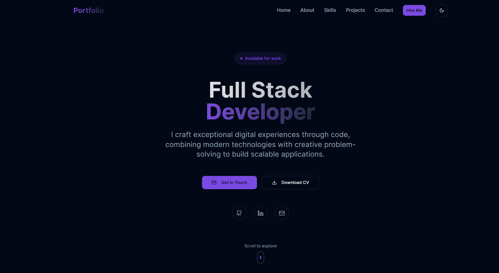

# 🚀 Stellar Hub - Modern Developer Portfolio

A cutting-edge, interactive developer portfolio featuring stunning 3D visuals, dark/light mode theming, and smooth animations. Built with React, Three.js, and modern web technologies to showcase your professional profile in the most engaging way possible.



_Modern developer portfolio showcasing interactive 3D elements, responsive design, and professional project presentations with dark/light theme support._

## ✨ Featured Projects

Here are some highlighted projects from this portfolio:

- **Marsabit Event Platform**  
  [Live Demo](https://marsabit-event-sandy.vercel.app/)  
  A modern event management platform for Marsabit County, featuring event listings, ticketing, and real-time updates for attendees.

<!-- You can add more featured projects here as needed -->

## ✨ Features

### 🎨 **Visual Excellence**

- **Interactive 3D Scene** - Floating geometric objects with real-time lighting and shadows
- **Dark/Light Mode Toggle** - Seamless theme switching with system preference detection
- **Smooth Animations** - Framer Motion powered transitions and micro-interactions
- **Modern Design System** - Beautiful purple/violet accent colors with professional styling
- **Responsive Design** - Flawlessly adapts to all screen sizes and devices

### 🛠 **Technical Highlights**

- **Performance Optimized** - Efficient rendering with React Three Fiber
- **Accessibility First** - WCAG compliant with proper ARIA labels and keyboard navigation
- **SEO Ready** - Structured data and meta tags for optimal search engine visibility
- **Type Safety** - Full TypeScript implementation for robust development
- **CV Download** - One-click resume download with progress feedback

### 📱 **User Experience**

- **Smooth Scrolling** - Seamless navigation between sections
- **Mobile Responsive** - Touch-friendly interactions and mobile-optimized layouts
- **Fast Loading** - Optimized assets and efficient code splitting
- **Cross-browser Compatible** - Works flawlessly across all modern browsers
- **Keyboard Shortcuts** - Enhanced accessibility with keyboard navigation (Ctrl+D for CV download)

## 🎯 Sections

- **Hero** - Eye-catching introduction with animated call-to-actions and availability status
- **About** - Personal story, experience highlights, key strengths, and downloadable CV
- **Skills** - Categorized technology showcase with animated reveals
- **Projects** - Featured work with live demos and source code links
- **Contact** - Professional contact form and social media integration
- **Navigation** - Responsive navigation with theme toggle and mobile menu

## 🛠 Tech Stack

### **Frontend**

- [React 18](https://reactjs.org/) - Modern UI library with latest features
- [TypeScript](https://www.typescriptlang.org/) - Type-safe JavaScript
- [Vite](https://vitejs.dev/) - Lightning-fast build tool and dev server
- [React Router 6](https://reactrouter.com/) - Client-side routing

### **3D Graphics & Animation**

- [Three.js](https://threejs.org/) - 3D graphics library
- [React Three Fiber](https://github.com/pmndrs/react-three-fiber) - React renderer for Three.js
- [React Three Drei](https://github.com/pmndrs/drei) - Useful helpers for R3F
- [Framer Motion](https://www.framer.com/motion/) - Production-ready motion library

### **Styling & UI**

- [TailwindCSS 3](https://tailwindcss.com/) - Utility-first CSS framework
- [Radix UI](https://www.radix-ui.com/) - Unstyled, accessible UI components
- [Lucide React](https://lucide.dev/) - Beautiful & consistent icon library
- [Class Variance Authority](https://cva.style/) - Type-safe component variants
- [next-themes](https://github.com/pacocoursey/next-themes) - Perfect dark mode support

### **Backend & API**

- [Express.js](https://expressjs.com/) - Fast, unopinionated web framework
- [Zod](https://zod.dev/) - TypeScript-first schema validation
- [Netlify Functions](https://www.netlify.com/products/functions/) - Serverless API endpoints

### **Development Tools**

- [Vitest](https://vitest.dev/) - Fast unit testing framework
- [ESLint](https://eslint.org/) - Code linting and formatting
- [Prettier](https://prettier.io/) - Code formatting
- [PostCSS](https://postcss.org/) - CSS transformation toolkit

## 🚀 Quick Start

### Prerequisites

- Node.js 18+
- npm, yarn, or pnpm

### Installation

1. **Clone the repository**

   ```bash
   git clone https://github.com/kiganyamburu/builder-stellar-hub.git
   cd builder-stellar-hub
   ```

2. **Install dependencies**

   ```bash
   npm install
   # or
   yarn install
   # or
   pnpm install
   ```

3. **Start the development server**

   ```bash
   npm run dev
   ```

4. **Open your browser**
   Navigate to `http://localhost:8080` (or the port shown in terminal) to see your portfolio in action!

## 📁 Project Structure

```
├── client/                    # Frontend React application
│   ├── components/
│   │   ├── 3d/               # Three.js components
│   │   │   └── Scene.tsx     # Main 3D scene
│   │   ├── portfolio/        # Portfolio sections
│   │   │   ├── Navigation.tsx
│   │   │   ├── Hero.tsx
│   │   │   ├── About.tsx
│   │   │   ├── Skills.tsx
│   │   │   ├── Projects.tsx
│   │   │   └── Footer.tsx
│   │   ├── ui/               # Reusable UI components (Radix + Custom)
│   │   │   ├── button.tsx
│   │   │   ├── mode-toggle.tsx
│   │   │   ├── toast.tsx
│   │   │   └── ... (30+ components)
│   │   └── theme-provider.tsx # Dark/Light mode provider
│   ├── pages/                # Route components
│   │   ├── Index.tsx         # Homepage
│   │   └── NotFound.tsx      # 404 page
│   ├── lib/                  # Utility functions
│   │   ├── utils.ts          # Common utilities
│   │   └── download.ts       # File download utilities
│   ├── hooks/                # Custom React hooks
│   │   ├── use-mobile.tsx    # Mobile detection
│   │   └── use-toast.ts      # Toast notifications
│   ├── App.tsx               # App entry point with theme setup
│   └── global.css            # Global styles with CSS variables
├── server/                   # Express.js backend
│   ├── routes/               # API route handlers
│   │   └── demo.ts           # Example API route
│   ├── index.ts              # Server configuration
│   └── node-build.ts         # Production build script
├── netlify/                  # Netlify deployment configuration
│   └── functions/
│       └── api.ts            # Serverless function entry point
├── shared/                   # Shared types and utilities
│   └── api.ts                # API type definitions
├── public/                   # Static assets
│   ├── cv.pdf                # Downloadable resume
│   ├── favicon.ico
│   └── placeholder.svg
├── components.json           # shadcn/ui configuration
├── tailwind.config.ts        # Tailwind CSS configuration
├── postcss.config.js         # PostCSS configuration
├── vite.config.ts            # Vite client configuration
├── vite.config.server.ts     # Vite server configuration
└── netlify.toml              # Netlify deployment settings
```

## 🎨 Customization Guide

### **Dark/Light Mode Theming**

The project includes a complete theming system. Update colors in `client/global.css`:

```css
:root {
  /* Light mode colors */
  --background: 0 0% 100%;
  --foreground: 222.2 84% 4.9%;
  --primary: 262 80% 50%;
  /* ... other colors */
}

.dark {
  /* Dark mode colors */
  --background: 222.2 84% 4.9%;
  --foreground: 210 40% 98%;
  --primary: 262 80% 60%;
  /* ... other colors */
}
```

### **Theme Toggle Configuration**

Modify theme settings in `client/App.tsx`:

```tsx
<ThemeProvider
  attribute="class"
  defaultTheme="system"
  enableSystem
  disableTransitionOnChange
  storageKey="vite-ui-theme"
>
```

### **3D Scene Customization**

Modify the 3D elements in `client/components/3d/Scene.tsx`:

- Add new geometric shapes
- Adjust lighting and materials
- Change animation speeds and patterns
- Customize camera positions and controls

### **Content Updates**

Update your personal information in:

- `client/components/portfolio/Hero.tsx` - Name, title, bio, availability status
- `client/components/portfolio/About.tsx` - Experience, stats, CV download
- `client/components/portfolio/Skills.tsx` - Technologies and skill categories
- `client/components/portfolio/Projects.tsx` - Portfolio projects with links
- `public/cv.pdf` - Replace with your actual resume

### **CV Download Feature**

The CV download functionality includes:

- Progress indicators and loading states
- Toast notifications for user feedback
- Error handling with fallback mechanisms
- Analytics tracking ready (Google Analytics)
- Keyboard shortcut support (Ctrl+D)

### **Animation Customization**

Customize animations using Framer Motion:

```tsx
<motion.div
  initial={{ opacity: 0, y: 20 }}
  animate={{ opacity: 1, y: 0 }}
  transition={{ duration: 0.8, delay: 0.2 }}
  whileHover={{ scale: 1.05 }}
>
  Your content
</motion.div>
```

## 🚢 Deployment

### **Build for Production**

```bash
npm run build
```

This creates:

- `dist/spa/` - Static frontend files
- `dist/server/` - Server-side files

### **Local Production Testing**

```bash
npm start
```

### **Deploy to Netlify** (Recommended)

The project is pre-configured for Netlify deployment with:

1. **Automatic Deployment**:

   - Connect your GitHub repository to Netlify
   - Netlify will automatically detect the configuration from `netlify.toml`
   - Build Command: `npm run build:client`
   - Publish Directory: `dist/spa`

2. **Serverless Functions**:

   - API routes are automatically deployed as Netlify Functions
   - Located in `netlify/functions/api.ts`

3. **Environment Variables**:
   - Set any required environment variables in Netlify dashboard

### **Deploy to Vercel**

1. Install Vercel CLI: `npm i -g vercel`
2. Run: `vercel`
3. Follow the prompts

Alternative: Connect GitHub repository in Vercel dashboard

### **Deploy to Other Platforms**

For other hosting platforms:

1. Build the project: `npm run build`
2. Upload the `dist/spa` folder
3. Configure SPA routing redirects
4. Set up API routes if needed

### **Docker Deployment**

```bash
# Build the Docker image
docker build -t stellar-hub .

# Run the container
docker run -p 3000:3000 stellar-hub
```

## 🔧 Development

### **Available Scripts**

- `npm run dev` - Start development server
- `npm run build` - Build for production
- `npm run start` - Start production server
- `npm test` - Run tests
- `npm run typecheck` - Check TypeScript types
- `npm run format.fix` - Format code with Prettier

### **Adding New API Routes**

1. Create route handler in `server/routes/`
2. Register route in `server/index.ts`
3. Add types in `shared/api.ts`

### **Adding New Pages**

1. Create component in `client/pages/`
2. Add route in `client/App.tsx`

## 🎯 Performance Tips

- **3D Optimization**: Use `useFrame` sparingly and optimize geometries with `useMemo`
- **Image Optimization**: Use WebP format, proper sizing, and lazy loading
- **Code Splitting**: Lazy load components with `React.lazy()` and `Suspense`
- **Theme Performance**: CSS variables enable instant theme switching
- **Bundle Analysis**: Use `npm run build -- --analyze` to inspect bundle size
- **File Downloads**: Optimized download utilities with progress feedback
- **Animation Performance**: Use `transform` and `opacity` for hardware acceleration

## 🧪 Testing

```bash
# Run all tests
npm test

# Run tests in watch mode
npm run test:watch

# Run tests with coverage
npm run test:coverage

# Type checking
npm run typecheck
```

## 🔧 Available Scripts

- `npm run dev` - Start development server with hot reload
- `npm run build` - Build both client and server for production
- `npm run build:client` - Build only the frontend
- `npm run build:server` - Build only the backend
- `npm run start` - Start production server
- `npm test` - Run test suite
- `npm run typecheck` - Check TypeScript types
- `npm run format.fix` - Format code with Prettier

## 🛠 Development Workflow

### **Adding New UI Components**

1. Use shadcn/ui for base components:

   ```bash
   npx shadcn-ui@latest add component-name
   ```

2. Create custom components in `client/components/ui/`

### **Adding New API Routes**

1. Create route handler in `server/routes/`
2. Register route in `server/index.ts`
3. Add types in `shared/api.ts`
4. Update Netlify function in `netlify/functions/api.ts`

### **Adding New Pages**

1. Create component in `client/pages/`
2. Add route in `client/App.tsx`
3. Update navigation if needed

### **Theme Development**

1. Update CSS variables in `client/global.css`
2. Test both light and dark modes
3. Ensure proper contrast ratios for accessibility

## 🤝 Contributing

1. Fork the repository
2. Create your feature branch (`git checkout -b feature/AmazingFeature`)
3. Commit your changes (`git commit -m 'Add some AmazingFeature'`)
4. Push to the branch (`git push origin feature/AmazingFeature`)
5. Open a Pull Request

### **Development Guidelines**

- Follow TypeScript best practices
- Ensure accessibility compliance (WCAG 2.1)
- Test both light and dark themes
- Maintain responsive design
- Add proper error handling
- Include loading states for async operations

## 📄 License

This project is licensed under the MIT License - see the [LICENSE](LICENSE) file for details.

## 🙏 Acknowledgments

- **Three.js Community** - For the amazing 3D graphics library
- **React Three Fiber** - For making Three.js React-friendly
- **Radix UI** - For accessible, unstyled components
- **Tailwind CSS** - For the utility-first styling approach
- **Framer Motion** - For beautiful, performant animations
- **shadcn/ui** - For the component design system
- **Netlify** - For seamless deployment and serverless functions

## 📬 Contact

Feel free to reach out if you have any questions or suggestions!

- **Portfolio**: [Live Demo](https://builder-stellar-hub.netlify.app)
- **Email**: mburukiganya@gmail.com
- **LinkedIn**: [Kiganya Mburu](https://www.linkedin.com/in/kiganya-mburu-53a7b5231/)
- **Twitter**: [@kiganyamburu](https://x.com/kiganyamburu)
- **GitHub**: [@kiganyamburu](https://github.com/kiganyamburu)

---

Built using React, Three.js, and modern web technologies.
Built using React, Three.js, and modern web technologies.
